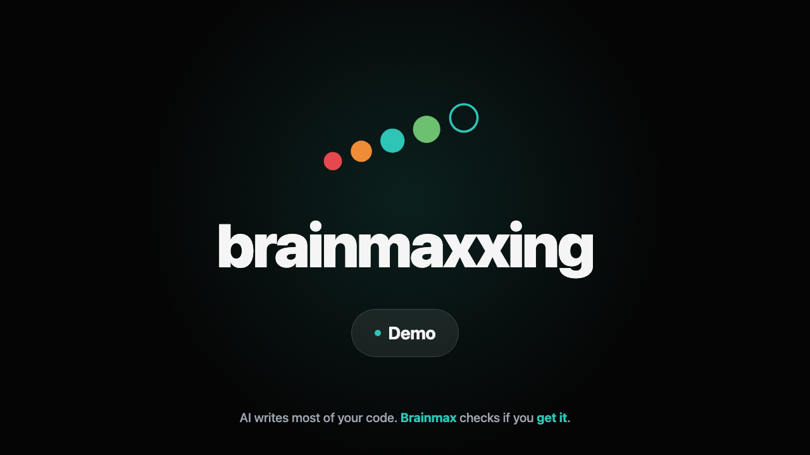

# BrainMaxxing

Agent skills that quiz students on software engineering concepts grounded in their actual codebase. Designed for early-career developers who co-create projects with AI and need to verify their conceptual understanding.

## The problem

AI coding agents make it easy to build sophisticated software without fully understanding the concepts behind it. BrainMaxxing helps students verify whether they actually understand what's in their project — or if they're just running code they can't explain.

## How it works

1. **Invoke `/brainmax`** in your project
2. The agent analyzes your codebase and detects which knowledge domains are implemented
3. You pick a domain (API Design, Database Design, Testing, etc.)
4. The agent quizzes you with 5 questions grounded in *your actual code*
    
    **Rooted in [Bloom's Taxonomy](https://en.wikipedia.org/wiki/Bloom%27s_taxonomy)**, questions escalate through cognitive levels:

    - **Explain** (Remember/Understand) → *describe what this **code does** and **why it exists***
    - **Predict** (Analyze) → ***trace behavior** through code without running it*
    - **Refactor** (Apply/Evaluate) → *identify **tradeoffs** and **improve** what's there*
    - **Debug** (Analyze/Evaluate) → *spot a real issue and **reason about its consequences***

5. Each answer is scored on a 0–3 rubric

    Evaluation and scoring mirrors the progession above: 

    - 0 → no recognition
    - 1 → names it but can't apply it
    - 2 → explains and reasons about change
    - 3 → evaluates tradeoffs and could teach it. 

6. When done, "compile report" to get your competency summary with personalized study recommendations

    <a href="https://gh.io/brainmaxxing/demo">
        
    </a>

## Skills

| Skill | What it quizzes |
|-------|----------------|
| `/brainmax` | Orchestrator — detects domains, routes to quizzes, compiles report |
| `/api-design` | REST/GraphQL/gRPC design, HTTP semantics, middleware |
| `/database-design` | Schema design, normalization, queries, migrations |
| `/system-architecture` | Service boundaries, communication, infrastructure |
| `/implementation-patterns` | Design patterns, abstractions, code organization |
| `/testing-strategy` | Test design, mocking, coverage, test pyramid |
| `/security-fundamentals` | Auth, validation, encryption, OWASP concepts |
| `/devops-and-ci-cd` | Pipelines, deployment, infrastructure as code |
| `/error-handling-and-resilience` | Retries, circuit breakers, graceful degradation |
| `/requirements-and-scope` | Requirements engineering, scope management |
| `/domain-modeling` | DDD concepts, aggregates, business rules |
| `/ui-and-frontend` | Component architecture, state, rendering, accessibility |
| `/observability` | Logging, metrics, tracing, health checks |

## Installation

```bash
npx skills add juliamuiruri4/brainmaxxing
```

## Maintaining bundled references

Each installed skill is self-contained. Runtime reference files live inside the individual skill directories so `npx skills add` works without needing a repository-level `shared/` directory.

`shared/` remains the canonical authoring source for shared quiz/orchestrator reference material. After editing a file in `shared/`, sync the bundled copies and verify they match:

```bash
./scripts/sync-skill-references.sh
./scripts/sync-skill-references.sh --check
```

## Design principles

- **Read-only**: Skills analyze code, never edit it
- **Grounded**: Every question references specific code in the student's project
- **Honest**: Never fabricates bugs, issues, or code that doesn't exist
- **One-at-a-time**: Questions are asked sequentially, not batched
- **Rubric-scored**: All answers scored on a consistent 0–3 rubric

## Canvas extension

The optional GitHub Copilot App canvas launches when `/brainmax` publishes its detected domains. Students can select a domain, read each question, submit freeform answers, follow their score, and review the compiled report from the canvas. Answers are relayed into the Copilot session; question generation and rubric scoring remain with the domain skills.

If the host does not open the canvas when `set_domains` is invoked, open BrainMax once from the Copilot App. The current quiz state will then stream into it automatically.

## License

MIT
